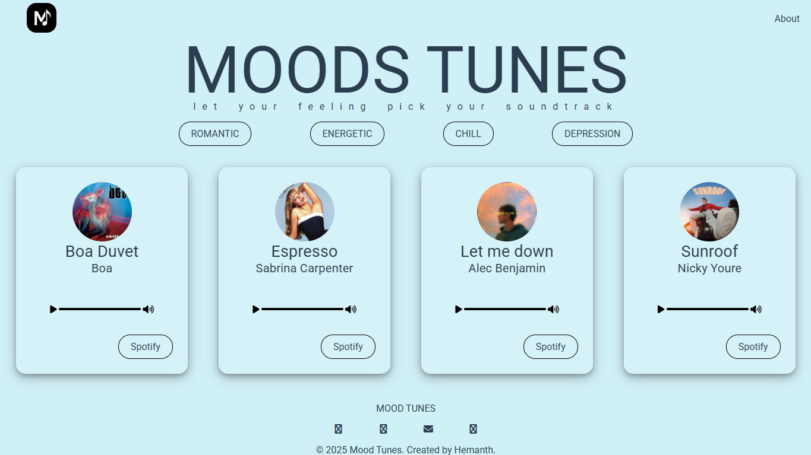

# Mood Tunes

## Overview
Mood Tunes is a web-based music playlist generator that tailors soundtracks based on your mood. Whether you're feeling romantic, energetic, or chill, the website provides a unique music experience for every occasion. The platform is fully responsive, designed to work seamlessly on both mobile and desktop devices.

## Features
- **Responsive Design:** The website adjusts beautifully on any screen size.
- **Category-based Music Selection:** Users can choose from categories such as Romantic, Energetic, Chill, and Depression.
- **Audio Player:** Integrated audio player to play songs directly from the platform.
- **Spotify Integration:** Links to songs on Spotify for easy access.
  
## Technologies Used
- **HTML5:** For the webpage structure.
- **CSS3:** For styling and responsive design.
- **JavaScript:** For dynamic interaction, audio controls, and effects.
- **Font Awesome:** For icons and visual elements.
- **Google Fonts:** For unique typography (Roboto, Great Vibes, Bebas Neue, etc.).

## Getting Started

### Prerequisites
To run this project locally, you just need a browser to view the HTML file. No backend setup is required.

##Screenshots
### 1. Home Page

### 2. Romantic

### 3. Energetic

### 4. Chill

### 5. Depression

### 6. About

### 7. mobile Page

### 8. mobile page

### 9. Tablet Page

### 10. Tablet Page

## Contact

If you have any questions or feedback, feel free to reach out:

- Email: hemnath04112004@gmail.com
- GitHub: [@Hemnath4114](https://github.com/Hemnath4114)

